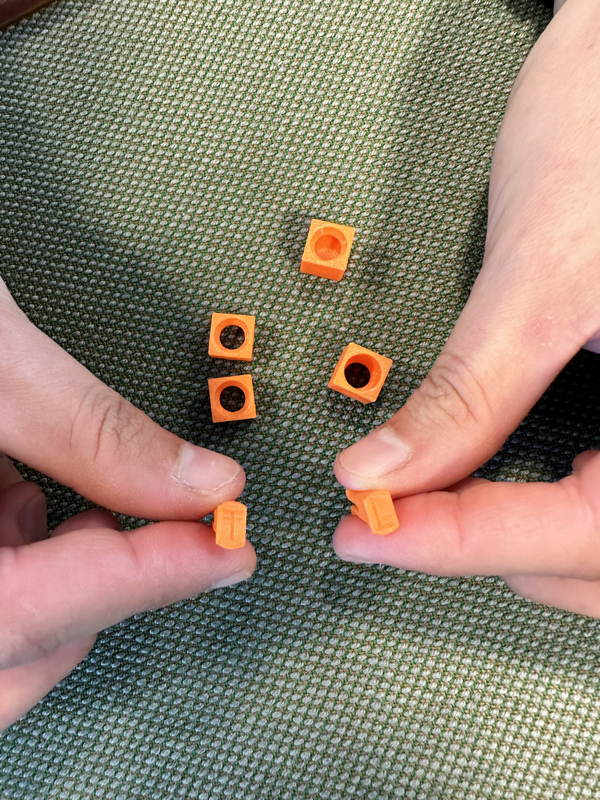
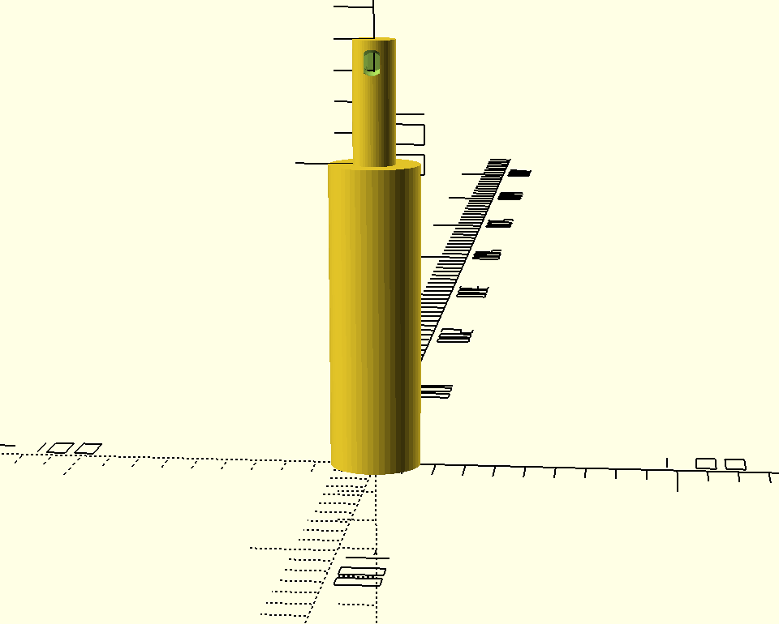
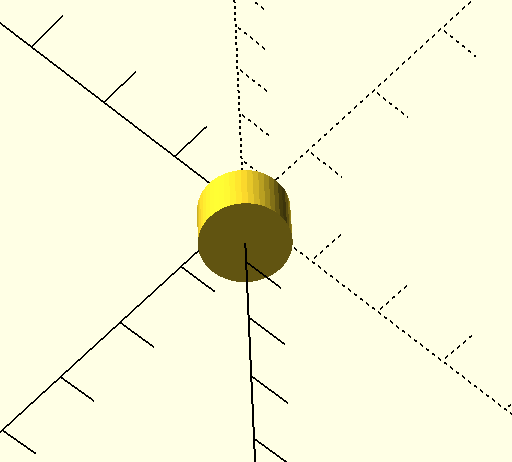
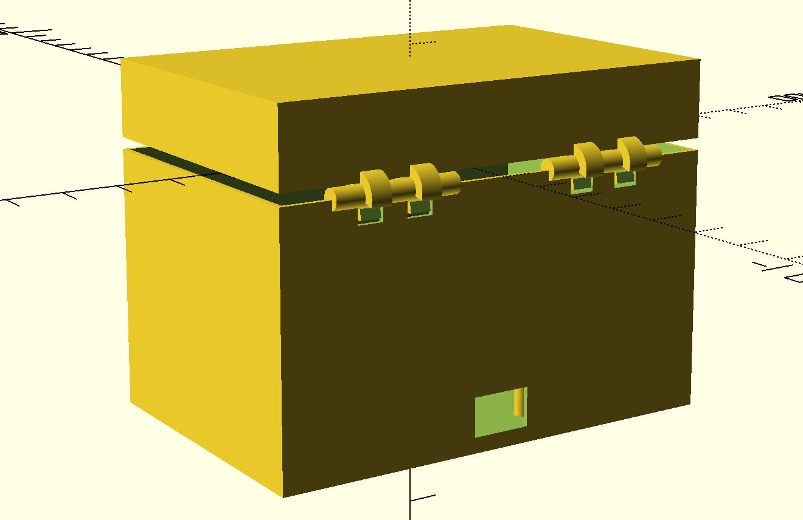
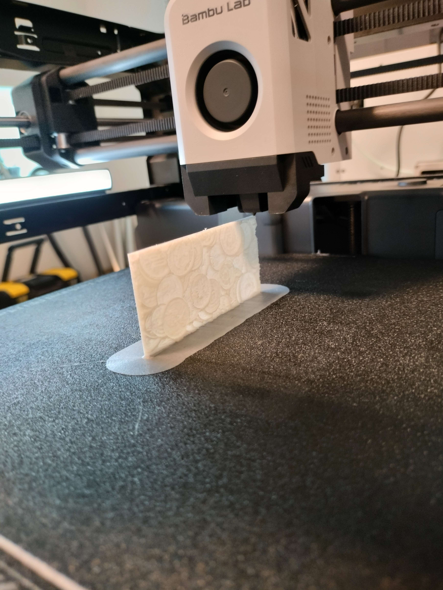

# RoA-logbog - Israa El-Haj Moussa
Valgfag: ***Robotter og Automatisering***

----

## 22-08-2023

På semesterets første dag, fik vi i klassen en introduktion til RoA som valgfag, 
lidt C++ og så fik vi udleveret en **NodeMCU 1.0 (ESP-12E Module)**, 
som vi skal arbejde med i forskellige projekter.

Jeg kunne desværre ikke gå igang med at eksperimentere med min NodeMCU, 
da jeg manglede et USB-C til Micro USB-kabel, 
fordi min Mac ikke understøtter den almindelige USB-indgang.
Denne blev heldigvis købt og leveret dagen efter, og morskaben kan nu for alvor gå igang. 

Derudover blev vi bedt om at downloade og konfigurere PlatformIO, 
som er et plugin til Visual Studio Code, 
som gør det muligt at programmere NodeMCU'en i **C++**.

Projekt: FirstBlink

```cpp
#include <Arduino.h>

void setup() {
  pinMode(LED_BUILTIN, OUTPUT);
}

void loop() {
  digitalWrite(LED_BUILTIN, HIGH);
  delay(1000);
  digitalWrite(LED_BUILTIN, LOW);
  delay(1000);
}
```

-----

## 25-08-2023

I dag fik vi en opgave, der gik ud på at lave et lyskryds i gruppen. Der var ikke nok dioder til at lave 2 lyskryds, så vi kunne kun lave 1,5. 
Vi blev ikke færdige på dagen, og fortsatte derfor arbejdet i gruppen i fritiden.

Projekt: traficlight + video

-----

## 29-08-2023
I dag fik vi vi en ny komponent vi skulle lege med. Denne gang var det en knap. Ved at trykke på knappen kunne vi tænde for en blå diode.
Hvder gruppe i klassen fik udleveret en komponent, som vi skulle lave noget med, og så skulle vi præsentere det for resten af klassen.
Vi fik en sonar, der kunne måle afstand. Vi prøvede i lang tid at få det til at virke, dog uden held. Dagen efter prøvede Tobias så, og det viste sig, at sonaren nok var defekt. 

Projekt: Button + sonar


-----

## 31-08-2023 
I dag skulle vi downloade et setup til vores NodeMCU, så vi kunne påvirke den igennem wifi. Vi valgte i gruppen at arbejde med 3 dioder, 
der hver havde deres farve, og påvirke dem til at slukke og tænde igennem wifi. Jeg glemte desværre at tage et billede af hvordan det så ud i browseren, 
men det er faktisk bare en url, hvor det er vi kan ændre stien. fx. /1 for tænd og /2 for sluk

Projekt: Wifi + video

-----
## 15-09-2023
I dag skulle vi 3D printe en samlemekanisme til vores togbane. Vi lavede dem i plenum, og startede med en prototype, som vi så kunne lave om på,
hvis der var noget der ikke passede. Vi justerede et par gange i bl.a. hullet og tykkelsen af benen på vores pin. 
På billederne er de grønne dem vi startede med at lave. 
Den første vi lavede var løs, så vi justerede i målene for at få pin og hul til at passe bedre sammen. Så havde vi en printerfejl på
numemr 2, og denne fik vi fikset ved at sætte den til at printe igen. Den tredje endte med at blive god, men vi justerede takken på "benet" den til 2mm og 3mm som blev endnu mere robuste.
Vi lavede også nogle med runde pin's og en stor sort version, så man bedre kunne se det.


-----
## 19-09-2023
I dag arbejdede vi videre på samlemekanismen fra vores sidste lektion. 
Vi skulle lave en ny version, som var drejelig. -tight/loose (T/L). Derudover bygegde vi videre på den, 
så den kunne blive længere, og man derfor kunne lave dem i forskellige størrelser.
Vi har fået den næste study-point opgave for, og denne går ud på at modelere noget, som bruger vores clicksystem.


-----
## 20-09-2023 + 21-09-2023
Her arbejdede vi på vores study-point opgave. Vi vil lave et udkast til en elektronisk tandbørste. 
Vi startede ud med en skitse tegnet på computeren, og gik derfor i tænkeboks om hvordan vi kunne lave den bedst. 


På den nederste del af skitsen, vil vi gerne lave plads til batterier.
Den endte med at blive ret godt, og vi fik lavet en prototype, som vi kan vise på fredag.
Vi støtte på et par problemer undervejs, da vi ikke helt vidste hvordan vi skulle spejle vores clicksystem, 
men vi endte dog med at løse det og fik lavet en dobbel-clicker.
Tandbørsten består af flere dele. Der er håndtaget hvor man holder på. Denne er lavet sådan, 
at der er et hul i toppen, som den øvre del af tandbørsten skal sidde fast på ved hjælp af en dobbel-clicker. 
Den øvre del af tandbørsten er lavet sådan, at der er et hul i bunden, 
som den nederste del af tandbørsten skal sidde fast på ved hjælp af den samme dobbel-clicker.
På den øverste del af tandbørsten er der et hul øverst i siden, hvor endnu en dobbel-clicker skal sidde på. 
På den anden ende af dobbelt-clickeren skal der sidde 2 runde "samle-dele" som skal holde tandbørstehovedet på plads.

**Håndtag + Øverste del af tandbærsten:**
  

**Dobbelt-clicker (loose):**  


**Dobbelt-clicker (tight):**  


**Samle-del (midten):**  
  

**Samle-del (enden):**  
  

Tandbørsten er ikke færdig, da planen var at lave et hulrum inde i til batterier, som det kan ses på vores originale skitse.

-----
## 22-09-2023 - 29-09-2023
Dagene er blevet brugt på at lave vores selvvalgte opgave. Vi har i fælleskab og sammen med Tobias valgt at droppe vores projekt med tog,
og i stedet arbejde på noget andet. I min gruppe har vi valgt at lave en spilledåse, der kan spille pirat musik. Den skal ligne en skattekiste.
Vi har arbejdet på bunden og toppen af boksen, lukke mekanismer, kroge samt lavet diveres features til boksen.
Udover at 3D printe, vil vi gerne gåøre brug af vores NodeMCU chip, dioder, buzzer, knap mm. til at lave en funktion, hvor når låget åbnes, 
så bliver der spillet en lyd, og dioderne tænder. Når kisten lukkes, så skal musikken stoppe med at spille

På dette billede ses 4 stolper, det er dem der kommer til at holde vores NodeMCU på plads. Hullet på højre side, er indgangen
til micro-usb stikket, som skal kobles på vores chip. 

Vi har stadig en del arbejde der skal gøres: printes, få styr på musikken og sætte det hele sammen.


-----
## 03-10-2023
I dag arbejdede vi videre på vores skattekiste. Vi fik lavet et testprint, og der var meget godt, da der var nogle ting, 
som skulle justeres, både i det hul til micro usb'en og ved hængslerne.
Vi fik musikken til at spille, og knappen virker nu, så man kan tænde og slukke for musikken.



-----
## 06-10-2023 - 10-10-2023
Idag fik vi printet vores litophane, og den er blevet rigtig fin. Vi har haft problemer med at dioderne,
ikke lyste ordentlgit op, så mønterne ikke kunne ses, men det arbejder vi på.
Knappen har fået loddet ledninger på.
Æsken er gjort lidt større så der lige præcis er plads til nodeMCU + små boards til dioderne i bunden. 
Der er blevet printet et større billede af mønterne til den nye størrelse æske. 
Der er blevet bygget en holder til knappen ind i æsken - den lille holder testprintede vi også 2 gange seperat. 
Og så har æsken fået kanter som møntbilledet kan ligge og hvile på. Og nu printes der så på livet løs.



Vi havde problemer med supporten til vores 3D print, og derfor blev det ikke så pænt som vi havde håbet på.
Så næste gang prøver vi igen og sætter det hele sammen.

Når det her projekt er færdigt, vil jeg se om ikke jeg kan få tid til et hygge-projekt i ferien.
Min inspiration er Simon-game, hvor man skal trykke på forskellige knapper med hver deres tilhørende farver,
og huske den sidste kombination. Jeg har samlet en masse ledninger, knapper, dioder, modstande, jumpere og en buzzer til spillet,
og så må vi se hvor det fører hen.

-----
## 13-10-2023
I dag fik vi lavet sidste print, sat musikken til og det hele spiller. 
Her kommer nogle billeder af selve processen, med en video til sidst der viser vores færdige produkt:

Dette er vores første æske, og her har vi ikke lavet et rundt låg, men et fladt. 
I vores kode kan man selv vælge, om man vil have et fladt eller rundt låg.

Dette er det endelige design:


Slut produkt (video):
https://github.com/Israa1809/RoA-logbog/blob/main/Images/IMG_4454.mov

-----
## 14-10-2023 - 

Inspiration:

-----